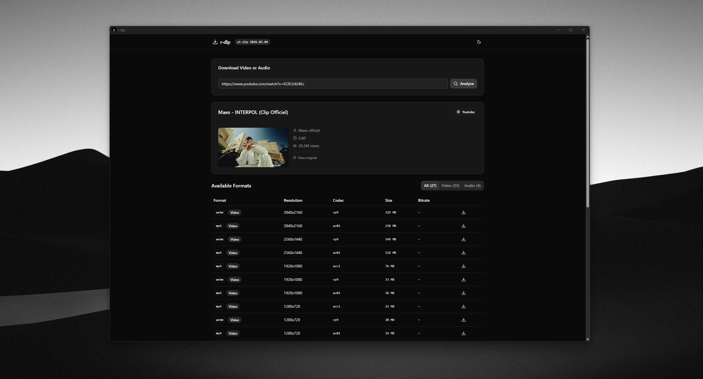

# r-dlp

A desktop video and audio downloader powered by [yt-dlp](https://github.com/yt-dlp/yt-dlp). Built with Tauri v2, React 19, and Rust.



## Features

- Paste any URL and analyze available formats (video, audio, or both)
- Browse detailed format info: resolution, codec, bitrate, file size
- Download directly to your chosen location via native file dialog
- Open downloaded files in your system file explorer
- Auto-installs yt-dlp on first launch
- Dark / light theme
- Browser impersonation with automatic retries and per-site preferences

## Browser impersonation

Open **Settings** (the gear in the header) to choose the default behavior:

- **Automatic**: try a normal request, then browser impersonation after a recoverable failure.
- **Always impersonate**: start with the preferred browser immediately.
- **Never impersonate**: do not force browser impersonation or use the app's browser fallback.

The initial configuration uses Automatic globally and Always impersonate with
Chrome for `tiktok.com`, including its subdomains. Add, edit or remove site
exceptions to override the global behavior. More specific domains take priority.
If the preferred browser fails or is unavailable, r-dlp tries Chrome, Edge,
Firefox, Safari, then other detected browser families once each. Local file
errors, authentication requirements, unavailable videos, pause and cancellation
do not trigger browser retries.

The engine used by the app may differ from `py -m yt_dlp`. r-dlp checks its local
installation, system yt-dlp, and existing Python installations. On Windows this
includes versions registered with the Python launcher. A compatible Python
installation is used when the regular engine lacks browser profiles. Nothing is
installed into Python automatically. Use **Refresh capabilities** after updating
an engine or its dependencies; **Engine diagnostics** shows versions and profiles.

Impersonation needs `curl_cffi` in the **same installation** as yt-dlp. See the
[yt-dlp impersonation documentation](https://github.com/yt-dlp/yt-dlp#impersonation).
It cannot guarantee access when a site blocks your IP address or requires login.

Settings are stored in `settings.json` in Tauri's per-user application config
directory (`%APPDATA%/com.r-dlp.app` on Windows). Changes apply to new requests,
downloads that have not started transferring yet, and manual resumes/retries.
An active request keeps its settings until it finishes. The browser and engine
that succeeded are reused for filename lookup and download unless settings change.
App commands use `--ignore-config` so external yt-dlp configuration files do not
override these preferences. Cookie configuration is not implemented yet; request
options are centralized in the Rust execution service for that future extension.

## Tests

```bash
cargo test --manifest-path src-tauri/Cargo.toml
pnpm --filter @r-dlp/frontend test
pnpm lint
pnpm --filter @r-dlp/frontend build
```

An opt-in integration test analyzes and downloads a public video into an
automatically cleaned temporary directory, then checks it with `ffprobe` (required
on PATH for this test). In PowerShell:

```powershell
$env:RDLP_SMOKE_URL = 'https://example.org/public-video-url'
# Optional: also test forced Chrome impersonation
$env:RDLP_SMOKE_IMPERSONATE = '1'
cargo test --manifest-path src-tauri/Cargo.toml public_video_download -- --ignored --nocapture
```

## Supported Sites

Powered by yt-dlp, r-dlp supports **1000+ websites** including:

YouTube, Twitch, Twitter/X, Instagram, TikTok, Facebook, Reddit, Dailymotion, Vimeo, SoundCloud, Bandcamp, Bilibili, Niconico, and [many more](https://github.com/yt-dlp/yt-dlp/blob/master/supportedsites.md).

## Tech Stack

| Layer    | Technology                          |
|----------|-------------------------------------|
| Frontend | React 19, TypeScript, TailwindCSS 4, shadcn/ui |
| Backend  | Rust, Tauri v2                      |
| Engine   | yt-dlp (auto-installed)             |

## Getting Started

### Prerequisites

- [Node.js](https://nodejs.org/) (v18+)
- [pnpm](https://pnpm.io/)
- [Rust](https://www.rust-lang.org/tools/install)

### Development

```bash
# Install dependencies
pnpm install

# Run in development mode
pnpm tauri dev
```

### Build

```bash
pnpm tauri build
```
